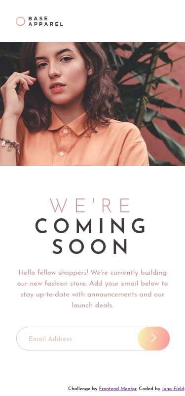

# Frontend Mentor - Base Apparel coming soon page solution

This is a solution to the [Base Apparel coming soon page challenge on Frontend Mentor](https://www.frontendmentor.io/challenges/base-apparel-coming-soon-page-5d46b47f8db8a7063f9331a0). Frontend Mentor challenges help you improve your coding skills by building realistic projects. 

## Table of contents

- [Overview](#overview)
  - [The challenge](#the-challenge)
  - [Screenshot](#screenshot)
  - [Links](#links)
- [My process](#my-process)
  - [Built with](#built-with)
  - [What I learned](#what-i-learned)
  - [Continued development](#continued-development)
  - [Useful resources](#useful-resources)
- [Author](#author)
- [Acknowledgments](#acknowledgments)


## Overview

### The challenge

Users should be able to:

- View the optimal layout for the site depending on their device's screen size
- See hover states for all interactive elements on the page
- Receive an error message when the `form` is submitted if:
  - The `input` field is empty
  - The email address is not formatted correctly

### Screenshot

#### Mobile


#### Desktop


### Links

- Solution URL: [https://github.com/JunoField/fm8-base-apparel-coming-soon-page](https://github.com/JunoField/fm8-base-apparel-coming-soon-page)
- Live Site URL: [https://junofield.github.io/fm8-base-apparel-coming-soon-page](https://junofield.github.io/fm8-base-apparel-coming-soon-page)

## My process

### Built with

- Semantic HTML5 markup
- JavaScript and HTML DOM
- CSS custom properties
- Mobile-first workflow
- Grid
- [SASS](https://sass-lang.com/) - CSS extension framework
- [Parcel](https://parceljs.org/) - Provides testing server, build tools, etc.


### What I learned

The email validation was fairly new to me - I had to use a regex, along with an event listener on the button to bind it to the Enter key.

```js
//regex
/^(([^<>()[\]\\.,;:\s@\"]+(\.[^<>()[\]\\.,;:\s@\"]+)*)|(\".+\"))@((\[[0-9]{1,3}\.[0-9]{1,3}\.[0-9]{1,3}\.[0-9]{1,3}\])|(([a-zA-Z\-0-9]+\.)+[a-zA-Z]{2,}))$/)
```

```js
//event listener for enter key
input.addEventListener("keypress", function(event) {
  if (event.key === "Enter") {
    event.preventDefault();
    validateEmail();
  }
}); 
```

### Continued development

I would like to revisit the validation, the shadows and the colours - I somewhat rushed these and they aren't identical to the design (it also doesn't help that the style guide was completely incorrect).

### Useful resources

- [https://www.w3schools.com/howto/howto_js_trigger_button_enter.asp
](https://www.w3schools.com/howto/howto_js_trigger_button_enter.asp) - I used this to ensure that the Enter button triggers the email validation, However I changed it slightly to trigger the email validation instead of clicking the button - this just seemed more streamlined.
- [https://stackoverflow.com/questions/46155/how-can-i-validate-an-email-address-in-javascript](https://stackoverflow.com/questions/46155/how-can-i-validate-an-email-address-in-javascript) - To validate the email, I used this regex. In practice I would send a verification email from server side, but this was sufficient to test the project.


### Author

- GitHub - [JunoField](https://github.com/JunoField)
- Frontend Mentor - [@JunoField](https://www.frontendmentor.io/profile/JunoField)
